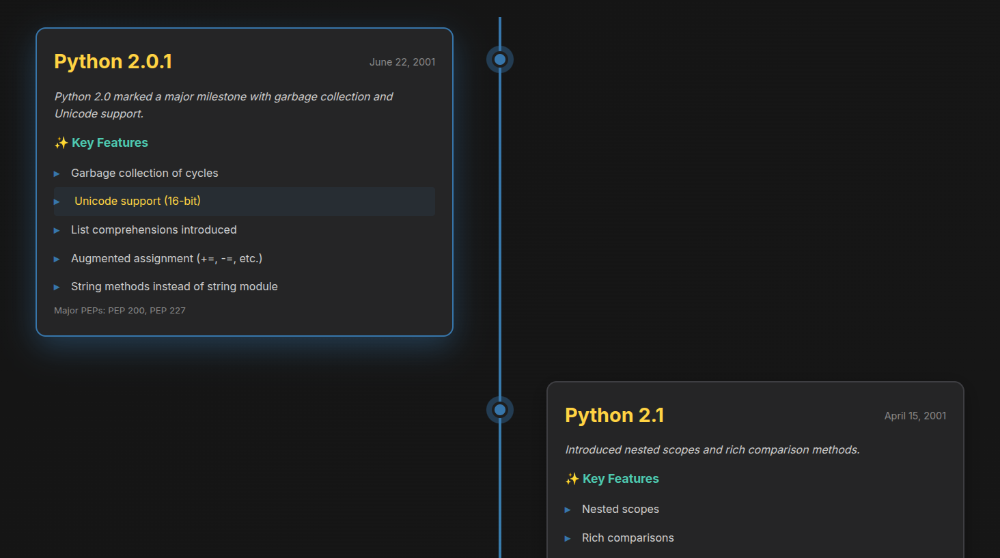

# Python History Tour

An interactive visual journey through Python's evolution from version 2.0.1 (2001) to 3.14 (2025).

[](https://github.com/dannyblaker/)

## Features

- 📅 **Interactive Timeline**: Explore all major Python releases with detailed feature highlights
- 💡 **Clickable Feature Examples**: Click any feature in the timeline to see a code example in a popup
- ⚡ **Code Comparison**: See the dramatic improvements between Python 2.0.1 and 3.14 side-by-side
- 📊 **Statistics Dashboard**: Visualize Python's growth over 24 years
- 🎨 **Beautiful UI**: Modern, responsive design with smooth animations

## Quick Start

Run the entire project with a single command:

```bash
docker compose up
```

Then open your browser to: **http://localhost:5000**

## Screenshot



## What's Included

### Timeline View
- All major Python versions from 2.0.1 to 3.14
- Release dates and key features for each version
- **Click any feature** to see a code example in a popup modal
- Filter by Python 2.x or 3.x versions
- Beautiful visual timeline with animations
- Over 50 interactive feature examples with code snippets

### Code Comparison
- Real-world example comparing Python 2.0.1 and 3.14
- Same functionality, showing 24 years of improvements
- Highlights modern features like:
  - F-strings
  - Type hints
  - Dataclasses
  - Pattern matching
  - Context managers
  - And much more!

### Statistics
- 24 years of Python evolution
- 24+ major versions
- 10x performance improvements
- 150+ major features added

## Project Structure

```
history_of_python/
├── docker-compose.yml      # Docker Compose configuration
├── Dockerfile             # Container definition
├── requirements.txt       # Python dependencies
├── app.py                # Flask application
├── python_versions.py    # Version data and code examples
├── templates/
│   └── index.html        # Main HTML template
└── static/
    ├── css/
    │   └── style.css     # Styling
    └── js/
        └── app.js        # Frontend JavaScript
```

## Technologies Used

- **Backend**: Python 3.14, Flask
- **Frontend**: HTML5, CSS3, Vanilla JavaScript
- **Container**: Docker, Docker Compose
- **Design**: Modern CSS Grid, Flexbox, Animations

## Highlights

### Python 2.0.1 (2001)
- Garbage collection
- Unicode support
- List comprehensions
- String methods

### Python 3.14 (2025)
- Free-threaded Python (no GIL)
- JIT compiler
- Type hints with Self and union operators
- F-strings with enhanced parsing
- Pattern matching
- Dataclasses
- Async/await
- And so much more!

## Development

To run without Docker:

```bash
pip install -r requirements.txt
python app.py
```

## License

MIT License - Feel free to use and modify!

## Author

Created with ❤️ using Python 3.14
